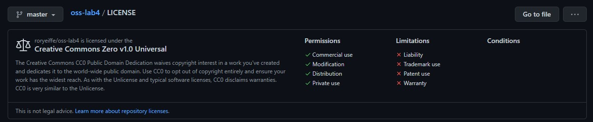

1.

2. 

3. When dealing with open-source/free software, it is necessary to look at things through a legality lense. (Ex: asking questions like "What are the legal repurcissions of what I am doing?") It is important to choose a license because if you don't, the default copyright laws would apply, disallowing anyone to modify and distribute your code. Thus, without a license, free software wouldn't be "free" anymore. Choosing a license allows us to specify exactly how our code can be modified and reused so there is no ambiguity later on.

4. As mentioned before, without a license, a codebase is put under default copyright laws. Therefore, with no license, it is assumed that you are not allowed to modify/redistribute the code. You shouldn't use a project that doesn't have a license because you run the risk of facing legal trouble if the owner of the code specifically didn't want others to use it. 

5. I agree that opening up a project to the public is a much more effective way at getting things done (as the Web development team did) than working on something behind closed doors and trying to perfect it before releasing (as the Gopher development team did). It makes sense that the more people you have working on a project, the easier and more efficient it would be to finish the project. This is why open-source software is a good strategy, it allows at least some of the workload to be distributed to a bunch of different people. 

6. The GNU public license is intented to guarentee freedom to share/change software for all users. Anyone is allowed to view/modify/share software that is under the [GPL](https://www.gnu.org/licenses/old-licenses/gpl-2.0.en.html). It would make sense that Linux, whose goal was to be different than other operating systems in the sense that their users would be computer-literate, would use such a license. According to [this](https://opensource.com/business/14/12/linux-philosophy#:~:text=Linux%20treats%20everyone%20equally%20and,should%20be%20allowed%20to%20do.), Linux doesn't hide any of it's content behind GUI's because they assume that the user knows how to use a computer. The user has the freedom to do what they want, while not limited by system restrictions. This coincides with the philosophy of the GPL. Both the GPL and Linux aim to ensure freedome for their users.

7.  https://github.com/roryeiffe/Fresh-Results

8. 

Website | License Present | License
---------|:----------|:-------
Taper https://git.sr.ht/~rushsteve1/taper | Yes | GPL http://www.gnu.org/licenses/
Submitty https://github.com/submitty/submitty | Yes | Three Clause BSD License https://github.com/Submitty/Submitty/blob/master/LICENSE.md
YACS https://github.com/copperwater/yacs| Yes | MIT License https://opensource.org/licenses/MIT
Campus Map https://github.com/gaskij/rpicampusmap | Yes | GPL http://www.gnu.org/licenses/
Lavender https://github.com/kvverti/rusty-lavender | Yes | Mozilla Public License 2.0 https://www.mozilla.org/en-US/MPL/